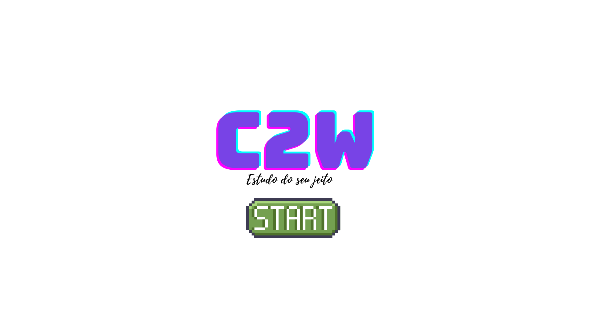

# C2W - Learning Platform with Artificial Intelligence

**C2W** is an innovative educational platform focused on teaching programming and robotics, developed using the Flask framework and powered by Artificial Intelligence. This project was created as part of the Samsung Innovation Campus and aims to transform education in schools and technical institutions by providing teachers with tools to effectively create and manage educational content.

## Table of Contents

- [About the Project](#about-the-project)
- [Features](#features)
- [Requirements](#requirements)
- [Installation](#installation)
- [Usage](#usage)
- [Contributing](#contributing)
- [License](#license)
- [Authors](#authors)

## About the Project

**C2W** (Class to World) is an online learning platform that uses Artificial Intelligence to adapt educational content according to the student's learning style. The platform allows for the creation of personalized courses that are continuously optimized based on students' performance and preferences using machine learning algorithms ad other stuff.

### Technologies Used

- Programming Language: Python
- Framework: Flask
- Artificial Intelligence: [Matplotlib,Sklearn]
- Database: SQLite3
- Other Tools: Git

## Features

- **Personalized Courses:** The platform adapts the content and difficulty of courses based on student progress.
- **Artificial Intelligence:** The system is powered by machine learning algorithms that recommend activities and content based on student behavior.
- **Course Management:** Creation, editing, and management of courses for various areas of knowledge.
- **Progress Monitoring:** Detailed reports on student performance, with insights generated by AI.

## Requirements

Ensure you have the following requirements installed:

- Python 3.8 or higher
- Flask 3.0 or higher
- [AI Tool: Matplotlib,Sklearn]
- SQLite3

## Installation

1. Clone the repository:

    ```bash
   https://github.com/allanlealluz/C2W-SAMSUNG_Project
    ```

2. Navigate to the project directory:

    ```bash
    cd C2W-SAMSUNG_Project
    ```

3. Create and activate the virtual environment:

    ```bash
    python3 -m venv venv
    source venv/bin/activate
    ```

4. Install the dependencies:

    ```bash
    pip install -r requirements.txt
    ```

5. Configure environment variables:

    ```bash
    cp .env.example .env
    # Edit the .env file as necessary
    ```

6. Run the project:

    ```bash
    python app.py
    ```

## Usage

After installation, access the platform at `127.0.0.1:5000`. Register and explore the available courses. The platform will monitor your progress and suggest new activities based on your performance.

## Contributing

Contributions are welcome! To contribute:

1. Fork the repository.
2. Create a branch for your feature (`git checkout -b feature/NewFeature`).
3. Commit your changes (`git commit -m 'Add NewFeature'`).
4. Push to the branch (`git push origin feature/NewFeature`).
5. Open a Pull Request.

## License

This project is licensed under the [MIT License](LICENSE).

## Authors

- **Allan Leal** - *Lead Developer* - [My LinkedIn](https://br.linkedin.com/in/allan-leal-programmer)

## Acknowledgments

Thanks to the **Samsung Innovation Campus** for the opportunity to develop this project and gain knowledge in AI and software development.
