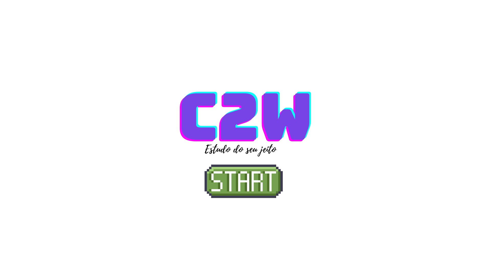

# C2W - Plataforma de Ensino com Inteligência Artificial



**C2W** é uma plataforma inovadora criada para atender às necessidades de ensino de robótica e programação para alunos do ensino fundamental. A plataforma faz a intermediação entre professores e alunos, dispondo de um design UX intuitivo, ferramentas de estatística e uso de IA para predição e análise do desempenho dos alunos, fornecendo feedbacks valiosos para que os professores possam adequar seus conteúdos de maneira mais eficaz.

## Tabela de Conteúdos

- [Sobre o Projeto](#sobre-o-projeto)
- [Funcionalidades](#funcionalidades)
- [Requisitos](#requisitos)
- [Instalação](#instalação)
- [Uso](#uso)
- [Contribuição](#contribuição)
- [Licença](#licença)
- [Autores](#autores)
- [Agradecimentos](#agradecimentos)

## Sobre o Projeto

**C2W** (Class to World) é uma plataforma de aprendizagem online que utiliza Inteligência Artificial para monitorar e analisar o desempenho dos alunos, fornecendo feedbacks detalhados para os professores. Dessa forma, os professores podem ajustar o conteúdo de ensino para atender melhor às necessidades dos alunos.

### Tecnologias Utilizadas

- Linguagem de Programação: Python
- Framework: Flask
- Inteligência Artificial: Matplotlib, Sklearn
- Banco de Dados: SQLite3
- Outras Ferramentas: Git

## Funcionalidades

- **Monitoramento Personalizado:** A plataforma adapta o acompanhamento do desempenho dos alunos com base no progresso de cada um.
- **Inteligência Artificial:** O sistema é alimentado por algoritmos de aprendizado de máquina que analisam o comportamento dos alunos.
- **Gestão de Cursos:** Ferramentas para auxiliar os professores na criação, edição e gestão de cursos.
- **Análise de Desempenho:** Relatórios detalhados sobre o desempenho dos alunos, com insights gerados por IA.

## Requisitos

Certifique-se de ter os seguintes requisitos instalados:

- Python 3.8 ou superior
- Flask 3.0 ou superior
- Matplotlib, Sklearn
- SQLite3

## Instalação

Clone o repositório:
```bash
https://github.com/allanlealluz/C2W-SAMSUNG_Project
  ```
## Installation

1. Clone the repository:

    ```bash
   https://github.com/allanlealluz/C2W-SAMSUNG_Project
    ```

2. Navigate to the project directory:

    ```bash
    cd C2W-SAMSUNG_Project
    ```

3. Create and activate the virtual environment:

    ```bash
    python3 -m venv venv
    source venv/bin/activate
    ```

4. Install the dependencies:

    ```bash
    pip install -r requirements.txt
    ```

5. Configure environment variables:

    ```bash
    cp .env.example .env
    # Edit the .env file as necessary
    ```

6. Run the project:

    ```bash
    python app.py
    ```

## Uso
Após a instalação, acesse a plataforma em 127.0.0.1:5000. Registre-se e explore as ferramentas disponíveis. A plataforma monitorará o desempenho dos alunos e fornecerá feedbacks valiosos para os professores.

## Contribuição
Contribuições são bem-vindas! Para contribuir:

Faça um fork do repositório.

Crie uma branch para sua funcionalidade (git checkout -b feature/NovaFuncionalidade).

Comite suas mudanças (git commit -m 'Adiciona NovaFuncionalidade').

Faça um push para a branch (git push origin feature/NovaFuncionalidade).

Abra um Pull Request.

## Licença
Este projeto é licenciado sob a Licença MIT.

## Autores
Allan Leal - Desenvolvedor Principal - Meu LinkedIn

## Agradecimentos
Agradecimentos ao Samsung Innovation Campus pela oportunidade de desenvolver este projeto e adquirir conhecimentos em IA e desenvolvimento de software.
